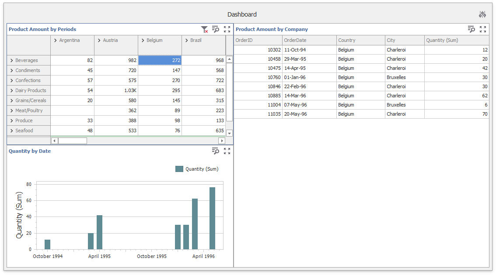
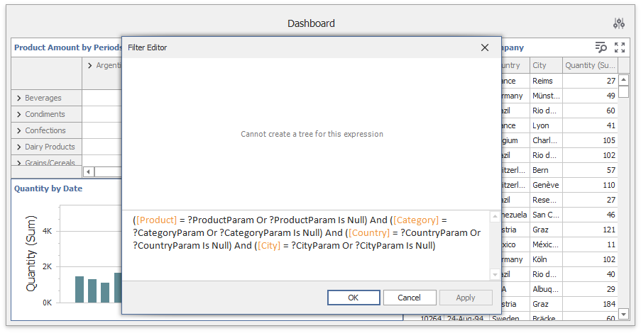

<!-- default badges list -->

[](https://supportcenter.devexpress.com/ticket/details/T837173)
[](https://docs.devexpress.com/GeneralInformation/403183)
<!-- default badges end -->
# 	Dashboard for WinForms - How to use the Pivot dashboard item as a Master Filter item

This example demonstrates how to make the [Pivot](https://docs.devexpress.com/Dashboard/15266/create-dashboards/create-dashboards-in-the-winforms-designer/designing-dashboard-items/pivot) dashboard item behaves like a single-select [Master Filter](https://docs.devexpress.com/Dashboard/116912/common-features/interactivity/master-filtering) item. This approach uses several features: filtering by [dashboard parameters](https://docs.devexpress.com/Dashboard/16135/create-dashboards/create-dashboards-in-the-winforms-designer/data-analysis/using-dashboard-parameters), [access to underlying controls](https://docs.devexpress.com/Dashboard/401095/create-the-designer-and-viewer-applications/winforms-designer/access-to-underlying-controls), [conditional formatting](https://docs.devexpress.com/Dashboard/114411/create-dashboards/create-dashboards-in-the-winforms-designer/designing-dashboard-items/pivot/conditional-formatting), and API methods to access the [underlying data](https://docs.devexpress.com/Dashboard/401192/common-features/underlying-and-displayed-data).



## Example Overview

1.	Create a set of dashboard parameters corresponding to dimensions in the [Pivot](https://docs.devexpress.com/Dashboard/15266/create-dashboards/create-dashboards-in-the-winforms-designer/designing-dashboard-items/pivot) item you want to use for filtering. This example uses four parameters: _ProductParam_, _CategoryParam_, _CountryParam_, and _CityParam_. They correspond to the _Product_, _Category_, _Country_, and _City_ fields used in the rows and columns section of the _Product Amount by Periods_ Pivot item.

2.	Handle the [DashboardDesigner.DashboardItemClick](https://docs.devexpress.com/Dashboard/DevExpress.DashboardWin.DashboardDesigner.DashboardItemClick) event to get dimensions' values from the clicked element and pass them to dashboard parameters. 

    ```cs
    void OnDashboardItemClick(object sender, DashboardItemMouseActionEventArgs e) {
        if(e.DashboardItemName == "pivotDashboardItem1" && !skipFiltering) {
            dashboardDesigner1.BeginUpdateParameters();
            //clear all parameters
            ClearPivotFilter();
            //set selected columns and rows to parameters
            SetParameterValue(e.GetAxisPoint("Column"));
            SetParameterValue(e.GetAxisPoint("Row"));
            dashboardDesigner1.EndUpdateParameters();
        }
    }
    ```

    The _skipFiltering_ variable indicates whether the _Expand / Collapse_ button is pressed, and is used to skip setting filters in this case.

3. The code snippet above does not set or clear dimension values inaccessible for the clicked element. You need to set parameter values that correspond only to the selected intersection and clear previous values in the dashboard parameters before setting new ones.

    Create the following methods used to clear parameter values:

    ```cs
    void ClearPivotFilter() {
        PivotDashboardItem pivotItem = dashboardDesigner1.Dashboard.Items["pivotDashboardItem1"] as PivotDashboardItem;
        ClearParameters(pivotItem.Columns);
        ClearParameters(pivotItem.Rows);
    }

    void ClearParameters(DimensionCollection dimensions) {
        foreach(var dimension in dimensions)
            dashboardDesigner1.Parameters[GetParameterDataMember(dimension.DataMember)].SelectedValue = null;
    }
    ```

4. The Dashboard Designer raises the [DashboardDesigner.DashboardItemClick](https://docs.devexpress.com/Dashboard/DevExpress.DashboardWin.DashboardDesigner.DashboardItemClick) event when an end user clicks the _Expand / Collapse_ button in a row or column. Handle the [DashboardDesigner.DashboardItemControlCreated](https://docs.devexpress.com/Dashboard/DevExpress.DashboardWin.DashboardDesigner.DashboardItemControlCreated) event to skip setting filters in this case.

    ```cs        
    bool skipFiltering = false;
    private void dashboardDesigner1_DashboardItemControlCreated(object sender, DevExpress.DashboardWin.DashboardItemControlEventArgs e) {
        if(e.DashboardItemName == "pivotDashboardItem1") {
            e.PivotGridControl.MouseDown += PivotGridControl_MouseDown;
        }
    }

    private void PivotGridControl_MouseDown(object sender, MouseEventArgs e) {
        PivotGridControl pivot = sender as PivotGridControl;
        PivotGridHitInfo hi = pivot.CalcHitInfo(e.Location);
        skipFiltering = (hi.ValueInfo != null && hi.ValueInfo.ValueHitTest == PivotGridValueHitTest.ExpandButton);
    }

    ```
4. To filter other dashboard items by dashboard parameters related to the Pivot Item, add all required dimensions to these items. If you do not want to display dimensions to end users, place dimensions to the "Hidden Dimensions" section.

    Then add the following filter expression to the dashboard item:

    ```
    ([Dimension1] = ?Dimension1Param Or ?Dimension1Param Is Null) And
    ([Dimension2] = ?Dimension2Param Or ?Dimension2Param Is Null) And
    ...
    ([DimensionN] = ?DimensionNParam Or ?DimensionNParam Is Null)
    ```

    This example uses the following expression:

    ```
    ([Product] = ?ProductParam Or ?ProductParam Is Null) 
    And ([Category] = ?CategoryParam Or ?CategoryParam Is Null) 
    And ([Country] = ?CountryParam Or ?CountryParam Is Null) 
    And ([City] = ?CityParam Or ?CityParam Is Null)
    ```

    The image below shows the expression for the Chart and Grid dashboard items:

    

The steps above are sufficient to implement the minimal filtering functionality. Further steps improve the UI behavior.


1.	**Optional.** To highlight cells selected in the Pivot Grid, add the format rule with the following expression:

    ```
    (?CityParam Is Not Null Or ?CountryParam Is Not Null Or ?ProductParam Is Not Null Or ?CategoryParam Is Not Null) And ([Product] = ?ProductParam Or ?ProductParam Is Null) And ([Category] = ?CategoryParam Or ?CategoryParam Is Null) And ([Country] = ?CountryParam Or ?CountryParam Is Null) And ([City] = ?CityParam Or ?CityParam Is Null)
    ```

2. **Optional.** Handle the [DashboardDesigner.CustomizeDashboardItemCaption](https://docs.devexpress.com/Dashboard/DevExpress.DashboardWin.DashboardDesigner.CustomizeDashboardItemCaption) event to add the _Clear Master Filter_ button to the item’s caption:

    ```cs
    void OnCustomizeDashboardItemCaption(object sender, CustomizeDashboardItemCaptionEventArgs e) {
        if(e.DashboardItemName == "pivotDashboardItem1") {
            DashboardToolbarItem showDataItem = new DashboardToolbarItem("Clear Master Filter",
                    new Action<DashboardToolbarItemClickEventArgs>((args) => {
                        dashboardDesigner1.BeginUpdateParameters();
                        ClearPivotFilter();
                        dashboardDesigner1.EndUpdateParameters();
                    }));
            showDataItem.Enabled = IsAnyFilterSet();
            showDataItem.SvgImage = svgImageCollection1[0];
            e.Items.Insert(0, showDataItem);
        }
    }
    ```

## Files to Review

* [Form1.cs](./CS/DesignerSample/Form1.cs) / (VB: [Form1.vb](./VB/DesignerSample/Form1.vb))

## Documentation

- [Master Filtering in the WinForms Designer](https://docs.devexpress.com/Dashboard/15702/winforms-dashboard/winforms-designer/create-dashboards-in-the-winforms-designer/interactivity/master-filtering)
- [The Pivot dashboard item](https://docs.devexpress.com/Dashboard/15266/winforms-dashboard/winforms-designer/create-dashboards-in-the-winforms-designer/dashboard-item-settings/pivot)
- [Dashboard Parameters in Windows Forms](https://docs.devexpress.com/Dashboard/16135/winforms-dashboard/winforms-designer/create-dashboards-in-the-winforms-designer/data-analysis/dashboard-parameters)
- [Access to Underlying Controls in the WinForms Dashboard Designer](https://docs.devexpress.com/Dashboard/401095/winforms-dashboard/winforms-designer/ui-elements-and-customization/access-to-underlying-controls)
- [Underlying and Displayed Data](https://docs.devexpress.com/Dashboard/401192/common-features/underlying-and-displayed-data)
- [Conditional Formatting](https://docs.devexpress.com/Dashboard/114401/winforms-dashboard/winforms-designer/create-dashboards-in-the-winforms-designer/appearance-customization/conditional-formatting)
